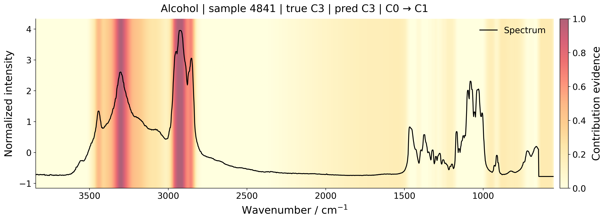
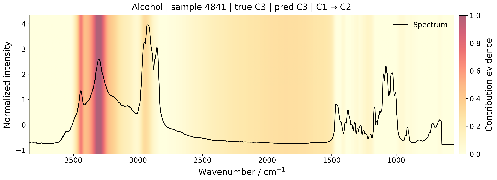
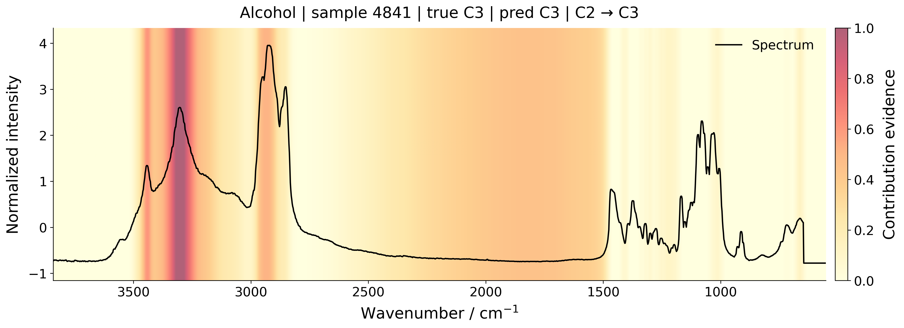
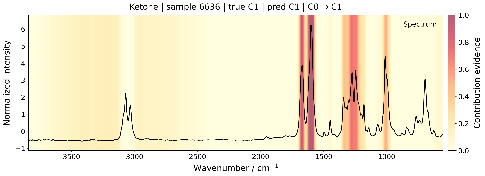
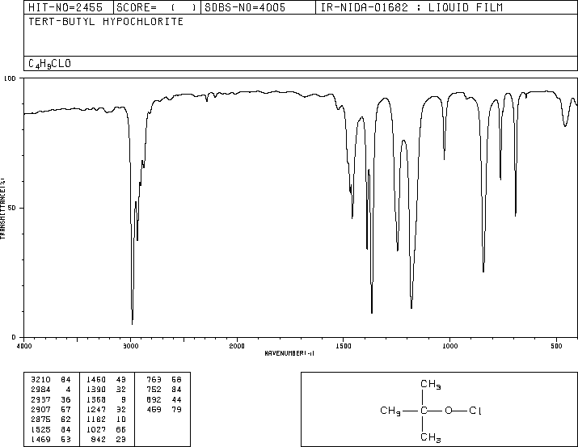
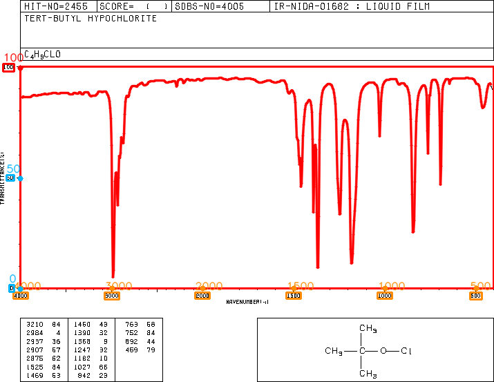

# CKAN-SpecNet

CKAN-SpecNet is an interpretable multi-task model for IR spectral functional-group analysis. It predicts both functional-group presence and coarse-grained count levels.

The KAN component and transition-evidence visualization are used to support model interpretation by checking whether predictions rely on chemically meaningful IR spectral regions.

## Installation

```bash
uv sync
```

For digitization utilities:

```bash
uv sync --extra digitization
```

## Required Files

The released evaluation data and released five-fold model files can be downloaded from Google Drive:

https://drive.google.com/drive/folders/1IC4L3ZADsPZVhuhMxcmgmN8wykg2d1Wk?usp=drive_link

After downloading, place the evaluation data at:

```text
data/test.parquet
```

Place the model files under:

```text
models/ckan_specnet_5fold/
  manifest.json
  fold_1.pt
  fold_2.pt
  fold_3.pt
  fold_4.pt
  fold_5.pt
```

`manifest.json` stores the model configuration, task definition, input length, normalization mode, and fold model filenames.

## Evaluation

Run the released five-fold ensemble on the released evaluation data:

```bash
uv run python scripts/evaluate.py --test data/test.parquet --run-dir models/ckan_specnet_5fold --out results/reproduce
```

The evaluation reports will be saved under:

```text
results/reproduce/
```

The output directory contains:

```text
summary.csv

main_test_task_metrics.csv
main_test_task_metrics_with_std.csv
main_test_fold_summaries.csv

swgdrug_task_metrics.csv
swgdrug_task_metrics_with_std.csv
swgdrug_fold_summaries.csv

xps_digitized_task_metrics.csv
xps_digitized_task_metrics_with_std.csv
xps_digitized_fold_summaries.csv
```

Report files:

```text
summary.csv                    overall metrics for each evaluation subset
*_task_metrics.csv             per-task metrics
*_task_metrics_with_std.csv    per-task metrics with fold-level standard deviation
*_fold_summaries.csv           fold-level summary metrics
```

Evaluation subsets in the released data:

```text
main_test        held-out NIST/SDBS pure-compound spectra
swgdrug          independent external FTIR-ATR spectra
xps_digitized    digitized external spectra from instrument-exported files
```

```bash
uv run python scripts/evaluate.py --help
```

## Single-Sample Prediction

```bash
uv run python scripts/predict.py --test data/test.parquet --run-dir models/ckan_specnet_5fold --eval-name main_test --sample-index 0 --out results/sample0_prediction.csv
```

The output CSV contains the true class, predicted class, predicted label, probability, and correctness for each task.

```bash
uv run python scripts/predict.py --help
```

## Interpretability

Transition-evidence visualization highlights spectral regions that support a transition between functional-group classes or count levels. It is not a deterministic structural assignment, but a diagnostic plot for checking whether the model relies on reasonable IR regions.

Automatically select a correctly predicted sample from a target class and save figures to `results/`:

```bash
uv run python scripts/plot_transition_evidence.py --test data/test.parquet --run-dir models/ckan_specnet_5fold --eval-name main_test --task alcohols_4class --class-id 3 --rank 1 --out results/transition_evidence/alcohols_4class
```

Use a specific sample:

```bash
uv run python scripts/plot_transition_evidence.py --test data/test.parquet --run-dir models/ckan_specnet_5fold --eval-name main_test --task ketones --sample-index 6636 --out results/transition_evidence/sample6636_ketones
```

```bash
uv run python scripts/plot_transition_evidence.py --help
```

## Digitization

The digitization utility converts an IR spectrum image into a numerical spectrum. Axis tick labels are recognized with `python-doctr`, and the extracted curve is saved together with diagnostic figures.

Convert a spectral image into a numerical spectrum:

```bash
uv run python scripts/digitize.py --input examples/example1.png --out results/digitize_example
```

Outputs:

```text
results/digitize_example/
  digitized_spectrum.csv
  spectrum.png
  axis_debug.png
```

Supported image inputs include common formats such as PNG, JPG, JPEG, BMP, TIFF, WEBP, and GIF.

```bash
uv run python scripts/digitize.py --help
```

## Released Evaluation Data

`data/test.parquet` is the fixed released evaluation data file. It contains spectra, labels, source information, and evaluation subset identifiers.

Evaluation subsets are distinguished by `_eval_name`:

```text
main_test        held-out NIST/SDBS pure-compound spectra
swgdrug          independent external FTIR-ATR spectra
xps_digitized    digitized external spectra from instrument-exported files
```

The original data source of each row is stored in `source_name`:

```text
sdbs             SDBS spectra
nist_gas         NIST gas-phase IR spectra
swgdrug          SWGDRUG spectra
xps_digitized    digitized external spectra
```

`main_test` comes from the model-development sources and consists of NIST gas-phase IR and SDBS spectra. During training reproduction, samples in `data/test.parquet` are excluded by `_sample_id`.

`swgdrug` and the digitized external spectra are not used for training and are only used for external robustness evaluation.

Main fields:

```text
spectrum          preprocessed IR spectrum vector
source_name       original data source
source_record_id  original source record identifier
source_path       local source path or generated source path
compound_name     compound name when available
smiles            SMILES
component_count   number of molecular components
_eval_name        evaluation subset name
_sample_id        unique sample identifier
label columns     functional-group presence/count labels
```

The label columns include binary functional-group presence labels and coarse-grained count labels, such as `_3class` and `_4class` tasks.

## Visual Examples

### Transition Evidence

Transition-evidence plots highlight spectral regions supporting class transitions in functional-group predictions.

<p align="center">
  
</p>

<p align="center">
  
</p>

<p align="center">
  
</p>

<p align="center">
  
</p>

### Spectrum Digitization

<p align="center">
  
</p>

<p align="center">
  
</p>

## Data Sources

The data used in this study were collected from:

- NIST Chemistry WebBook: https://webbook.nist.gov/chemistry/
- SDBS: https://sdbs.db.aist.go.jp
- SDBS acquisition method adapted from spectra-scraper: https://github.com/jgmotta98/spectra-scraper
- SWGDRUG: https://www.swgdrug.org

The released `data/test.parquet` also contains digitized spectra from commercial instrument exports.

Some raw data are not redistributed in this repository because the original databases, web materials, instrument-exported files, or additionally collected materials may have their own access, licensing, or redistribution restrictions. The released `data/test.parquet` is provided for direct evaluation reproduction.

## Training

```bash
uv run python scripts/train.py --parquet data/unified.parquet --test data/test.parquet --out results/new_run
```

Samples in `data/test.parquet` are excluded during training.

```bash
uv run python scripts/train.py --help
```

## Repository Layout

```text
ckan_specnet/
  core.py
  data.py
  model.py
  eval.py
  plot.py

scripts/
  evaluate.py
  predict.py
  plot_transition_evidence.py
  train.py
  digitize.py

data/
  test.parquet

models/
  ckan_specnet_5fold/

examples/
assets/
results/
```