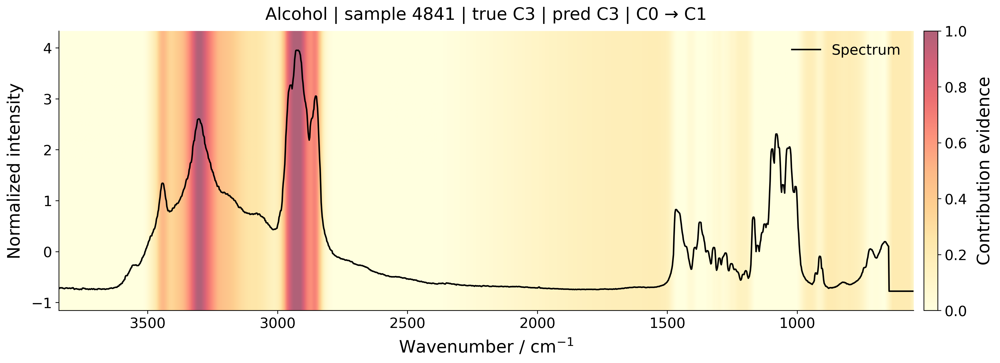
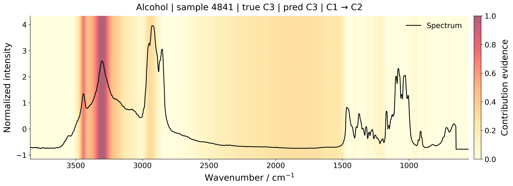
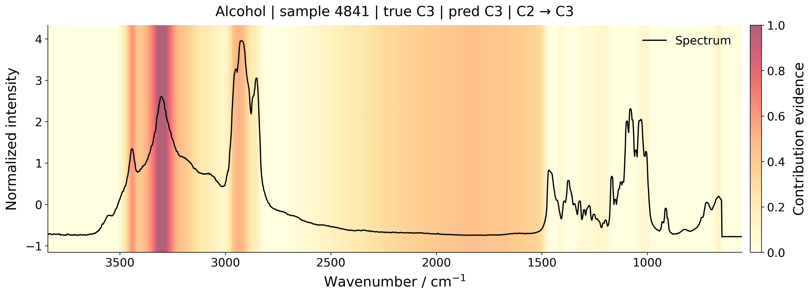
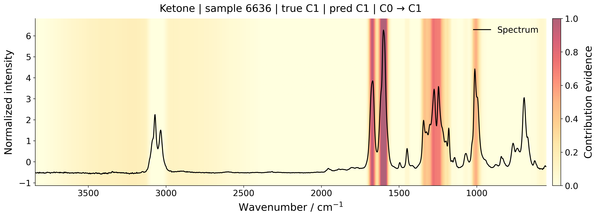
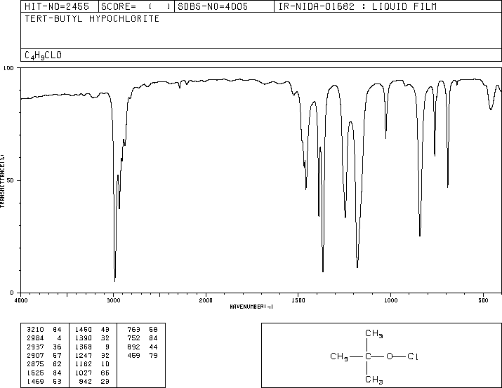
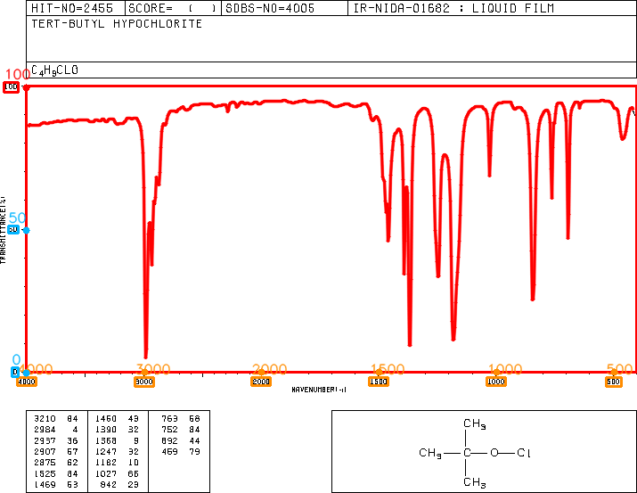

# CKAN-SpecNet

CKAN-SpecNet is an interpretable multi-task model for IR spectral functional-group analysis. It predicts both functional-group presence and coarse-grained count levels.

The KAN component and transition-evidence visualization are used to support model interpretation by checking whether predictions rely on chemically meaningful IR spectral regions.

## Installation

```bash
uv sync
```

For digitization utilities:

```bash
uv sync --extra digitization
```

## Repository Layout

```text
ckan_specnet/                     core package
  core.py                         task catalog, model config, shared constants
  data.py                         parquet loading, preprocessing, target building
  model.py                        CKAN-SpecNet architecture
  eval.py                         losses (Poly1 / CE), metrics, ensemble evaluation
  plot.py                         transition-evidence and spectrum plotting
  paths.py                        CLI path resolution helpers
  grad_track.py                   minority-class gradient + training-loss logging

scripts/
  evaluate.py                     five-fold ensemble evaluation on the released test set
  predict.py                      single-sample prediction
  plot_transition_evidence.py     KAN transition-evidence figures
  compute_enrichment.py           functional-group enrichment factors
  digitize_epochs.py              spectrum-image digitization (single image or whole folder)
  train.py                        five-fold training (loss switching + gradient logging)
  check_grad_tracking.py          self-check of the gradient-tracking formulas
  exp_process/                    MCR-ALS reaction-monitoring case study
  row_and_digital_comparation/    paired raw-vs-digitized analysis (1000 SDBS spectra)
  swgdrug_data_process/           SWGDRUG JCAMP -> spectral matrix + SMILES pipeline

examples/                         example spectrum images for the digitization demo
assets/                           figures used by this README
pyproject.toml
README.md
README_zh.md
```

`data/`, `models/` and `results/` are **not** shipped with the repository: they are created when the released files are placed as described below, and they hold every input and output of the commands in this document.

`zenode/` is only the staging folder for the dataset release and is **not** part of the repository.

## Released Data and Models: What to Download and Where to Put It

The released training corpus, the released evaluation set and the released five-fold model weights are distributed as a single archive:

```text
https://doi.org/10.5281/zenodo.XXXXXXX        <!-- TODO: replace with the published DOI -->
```

Unpacking the archive gives the folder structure used in the left column of the table below. Copy every file to the path in the right column:

| File in the downloaded archive | Copy it to | Consumed by |
|---|---|---|
| `test.parquet` (7,524 spectra) | `data/test.parquet` | `scripts/evaluate.py --test`, `scripts/predict.py --test`, `scripts/plot_transition_evidence.py --test`, `scripts/compute_enrichment.py --test`, `scripts/train.py --test` |
| `all.parquet` (40,850 spectra) | `data/all.parquet` | `scripts/train.py --parquet` |
| `model/manifest.json` | `models/manifest.json` | every `--run-dir models` |
| `model/fold_1.pt` … `model/fold_5.pt` | `models/fold_1.pt` … `models/fold_5.pt` | every `--run-dir models` |
| `raw_and_digital_comparation/row_selected_spectra.parquet` | `scripts/row_and_digital_comparation/row_selected_spectra.parquet` | `analyze_raw_vs_digital.py --raw` |
| `raw_and_digital_comparation/digital_selected_spectra.parquet` | `scripts/row_and_digital_comparation/digital_selected_spectra.parquet` | `analyze_raw_vs_digital.py --digital` |
| `raw_and_digital_comparation/selected_sdbs_id_smiles.csv` | `scripts/row_and_digital_comparation/selected_sdbs_id_smiles.csv` | record of the 1,000 sampled SDBS entries |
| `raw_and_digital_comparation/digitized_results.json` | `scripts/row_and_digital_comparation/digitized_results.json` | `plot_img and load _files_plot_histograms.ipynb` |
| `exp_data/digitized_results.json` | `scripts/exp_process/digitized_results.json` | `MCR-PLS and Predict.ipynb` (reference spectra) |
| `exp_data/exp_ftir_snapshots.csv` | `scripts/exp_process/exp_ftir_snapshots.csv` | `MCR-PLS and Predict.ipynb` (28 in-situ scans) |
| `swgdrug/smiles_result.txt` | `scripts/swgdrug_data_process/smiles_result.txt` | `swgdrug_data_process.ipynb` |

In short: the files that belong to a script folder go **into that script folder**, and only the corpus, the evaluation set and the model weights go to `data/` and `models/`. File names are kept exactly as released, so no renaming is needed anywhere.

Assuming the archive was unpacked into `zenode/` and you start in the repository root, the whole placement is:

```bash
mkdir -p data models
cp zenode/test.parquet              data/test.parquet
cp zenode/all.parquet               data/all.parquet
cp zenode/model/fold_*.pt zenode/model/manifest.json models/
cp zenode/raw_and_digital_comparation/* scripts/row_and_digital_comparation/
cp zenode/exp_data/*                    scripts/exp_process/
cp zenode/swgdrug/smiles_result.txt     scripts/swgdrug_data_process/
```

### Inputs that are not part of the release

* `analyze_p_check.py` additionally compares against two evaluation runs that you generate yourself (shown in *Paired Raw-vs-Digitized Analysis* below); if those folders are absent the comparison is simply reported as `missing` and the rest still runs.
* `swgdrug_data_process.ipynb` needs the original SWGDRUG JCAMP files. Download `https://www.swgdrug.org/IR/JCAMP_051524.zip`, extract it next to the notebook and point the notebook at the extracted folder (see *SWGDRUG Data Processing* below).

## Evaluation

Run the released five-fold ensemble on the released evaluation data:

```bash
uv run python scripts/evaluate.py --test data/test.parquet --run-dir models --out results/reproduce
```

The evaluation reports are saved under `results/reproduce/`:

```text
summary.csv                             overall metrics for each evaluation subset
<subset>_task_metrics.csv               per-task metrics
<subset>_task_metrics_with_std.csv      per-task metrics with fold-level standard deviation
<subset>_fold_summaries.csv             fold-level summary metrics
<subset>_per_class_metrics.csv          per-class precision/recall/f1/support
<subset>_per_class_metrics_with_std.csv per-class metrics with fold-level standard deviation
```

`<subset>` is one of the three evaluation subsets stored in `data/test.parquet`:

```text
main_test        held-out NIST/SDBS pure-compound spectra
swgdrug          independent external FTIR-ATR spectra
xps_digitized    digitized external spectra from instrument-exported files
```

```bash
uv run python scripts/evaluate.py --help
```

## Single-Sample Prediction

```bash
uv run python scripts/predict.py --test data/test.parquet --run-dir models --eval-name main_test --sample-index 0 --out results/sample0_prediction.csv
```

The output CSV contains, for every one of the 33 tasks, the true class, the predicted class, both class labels, the probability of the predicted class and whether the prediction is correct.

```bash
uv run python scripts/predict.py --help
```

## Interpretability

Transition-evidence visualization highlights the spectral regions that support a transition between functional-group classes or count levels. It is not a deterministic structural assignment, but a diagnostic plot for checking whether the model relies on reasonable IR regions.

Automatically select a correctly predicted sample of a target class and save the figures:

```bash
uv run python scripts/plot_transition_evidence.py --test data/test.parquet --run-dir models --eval-name main_test --task alcohols_4class --class-id 3 --rank 1 --out results/transition_evidence/alcohols_4class
```

Use a specific sample instead:

```bash
uv run python scripts/plot_transition_evidence.py --test data/test.parquet --run-dir models --eval-name main_test --task ketones --sample-index 6636 --out results/transition_evidence/sample6636_ketones
```

Each transition `C<n-1> -> C<n>` up to the predicted class is written as a PNG (and PDF/TIFF) into the output folder.

```bash
uv run python scripts/plot_transition_evidence.py --help
```

## Functional-Group Enrichment Factor Calculation

This script quantifies the **chemical interpretability** of CKAN-SpecNet by calculating enrichment factors for all 21 functional-group classification tasks.

### Core Definition

Enrichment factor quantifies whether model predictive evidence concentrates within chemically characteristic IR bands of each functional group:

$$
\text{Enrichment} = \frac{\text{Fraction of total transition evidence falling inside target IR regions}}{\text{Fraction of full spectral axis covered by target IR regions}}
$$

- Enrichment > 1: model predictive signals are enriched in chemically meaningful wavenumber ranges (desirable, physically consistent behaviour).
- Enrichment ≤ 1: model evidence is uniformly distributed or biased towards irrelevant spectral noise.

### Key Workflow

1. Predefined characteristic IR wavenumber ranges for each functional group (parsed from the reference IR peak table).
2. Load the five-fold ensemble model and run inference on held-out test data.
3. For every functional group and class transition (binary: C0→C1; ternary: C0→C1, C1→C2; quaternary: C0→C1, C1→C2, C2→C3):
   - Sample the top-confidence correctly predicted spectra of the target class.
   - Extract the KAN transition-evidence curves of every valid sample.
   - Compute two core metrics:
     1. `Evidence within regions (%)`: percentage of the total predictive signal located in functional-group-specific IR bands.
     2. `Spectral-axis coverage (%)`: percentage of the full input spectrum occupied by the target IR bands.
   - Derive the average enrichment factor across all valid samples of each transition.
4. Export aggregated statistics to CSV for supplementary analysis and manuscript plotting.

### Execution Command

```bash
uv run python scripts/compute_enrichment.py \
    --test data/test.parquet \
    --run-dir models \
    --eval-name main_test \
    --n-samples 10 \
    --smooth-window 15 \
    --out results/enrichment_result.csv
```

### Argument Explanation

| Argument | Description |
|----------|-------------|
| `--test` | Path to the released evaluation parquet file |
| `--run-dir` | Directory holding the five-fold ensemble weights and `manifest.json` |
| `--eval-name` | Target evaluation subset (`main_test` / `swgdrug` / `xps_digitized`) |
| `--n-samples` | Maximum number of top-confidence correctly predicted samples per class transition |
| `--smooth-window` | Smoothing window width for the raw transition-evidence curves |
| `--out` | Output CSV path for the enrichment-factor statistics |
| `--batch-size` | Inference batch size for the ensemble prediction |
| `--num-workers` | Dataloader worker count; keep 0 for Windows/Jupyter compatibility |

### Output CSV Columns

```text
Functional group             human-readable functional-group name
Transition                   class transition pair (C0->C1 / C1->C2 / C2->C3)
Chemically relevant regions  concatenated characteristic IR wavenumber ranges
Spectral-axis coverage (%)   fraction of the full spectrum covered by the target IR bands
Evidence within regions (%)  mean fraction of the model predictive signal inside the target IR bands
Enrichment                   average enrichment factor across valid samples
N samples                    number of valid samples used for the averaging
```

```bash
uv run python scripts/compute_enrichment.py --help
```

## Digitization

`scripts/digitize_epochs.py` converts IR spectrum images into numerical spectra. Axis tick labels are recognized with `python-doctr`, and the extracted curve is saved together with diagnostic figures. It accepts either a single image or a whole folder.

Single image (writes the CSV and the diagnostic figures):

```bash
uv run python scripts/digitize_epochs.py --input examples/example1.png --out results/digitize_example
```

```text
results/digitize_example/
  digitized_spectrum.csv    numerical spectrum
  spectrum.png              extracted spectrum curve
  axis_debug.png            axis-recognition debug figure
```

Folder (batch mode; all images are digitized in parallel and aggregated into one JSON):

```bash
uv run python scripts/digitize_epochs.py --input /path/to/spectrum_images --out results/digitize_batch
```

```text
results/digitize_batch/
  digitized_results.json    { "<image file stem>": {"x": [...], "y": [...]}, ... }
```

Supported image formats: PNG, JPG, JPEG, BMP, TIF, TIFF, WEBP, GIF.

```bash
uv run python scripts/digitize_epochs.py --help
```

## Training

```bash
uv run python scripts/train.py \
    --parquet data/all.parquet \
    --test data/test.parquet \
    --out results/new_run \
    --epochs 300 \
    --patience 30
```

Samples of `data/test.parquet` are excluded from training by `_sample_id`, so the released evaluation set never leaks into a training run. The released models were trained on the 28,257 single-component SDBS/NIST spectra that remain after that exclusion (each fold trains on four fifths of them, the rest being that fold's validation split).

### Loss selection

`--loss` switches between the Poly1 loss used in the paper and the plain cross-entropy control experiments:

```text
poly1      original Poly1 loss (default, reproduces the released models)
poly1_ce   Poly1 plus an extra plain cross-entropy term
ce         plain weighted cross-entropy (control experiment)
```

Supporting switches: `--epsilon` (Poly1 epsilon), `--ce-weight` (weight of the extra CE term), `--ce-use-class-weight` (apply class weights to that extra term as well), `--class-weight balanced|none`.

### Minority-class gradient and loss logging

Every run writes its loss curves and the minority-class gradient statistics incrementally, so a run can be inspected while it is still going:

```text
<out>/train_log.csv                per-epoch loss / gradient norm / learning rate / validation metrics
<out>/train_loss_by_task.csv       per-epoch loss decomposition for every task
<out>/minority_grad_by_epoch.csv   per-epoch gradient statistics of every minority (task, class)
<out>/minority_grad_specs.json     minority definition, actual class frequencies, metric definitions
<out>/manifest.json                model config, task definition, fold files, log file names
<out>/fold_<n>.pt                  the five fold checkpoints
```

Relevant switches: `--grad-track off|logit|full` (`full` adds last-classifier-layer parameter-gradient attribution; `logit` keeps only logits-space gradients), `--minority-mode group|class` (minority defined by the functional-group prevalence table or by the actual training class frequency), `--minority-threshold` (prevalence/frequency threshold in percent, default 5), `--no-val-loss` (skip the validation loss forward pass).

```bash
uv run python scripts/train.py --help
```

## Gradient-Tracking Self-Check

`scripts/check_grad_tracking.py` verifies that every formula used by the gradient logging agrees with autograd: the three loss variants, the per-sample logits gradient, the parameter-space attribution, the gradient propagated back to the shared representation, and the minority-class selection:

```bash
uv run python scripts/check_grad_tracking.py
```

## Paired Raw-vs-Digitized Analysis

The paper compares the same 1,000 SDBS spectra before and after image digitization. Reproducing that comparison takes three steps, all of which use the released files placed in `scripts/row_and_digital_comparation/`.

1. Produce the two evaluation runs that the verification step compares against:

```bash
uv run python scripts/evaluate.py \
    --test scripts/row_and_digital_comparation/row_selected_spectra.parquet \
    --run-dir models --out results/raw_1000_test_9_1

uv run python scripts/evaluate.py \
    --test scripts/row_and_digital_comparation/digital_selected_spectra.parquet \
    --run-dir models --out results/digital_1000_test_9_1
```

2. Re-run inference on both parquets, align them by `sample_id` and compute the paired agreement metrics (per-sample probabilities are cached under `results/anylize/raw_and_digital/predictions/`):

```bash
uv run python scripts/row_and_digital_comparation/analyze_raw_vs_digital.py \
    --raw scripts/row_and_digital_comparation/row_selected_spectra.parquet \
    --digital scripts/row_and_digital_comparation/digital_selected_spectra.parquet \
    --run-dir models \
    --out-dir results/anylize/raw_and_digital
```

Outputs: `summary.json`, the supplementary tables under `tables/` (`tableS5*`, `tableS6*`, `tableS9*`, `tableS10*`, `tableS11*`) and the figures under `figures/` (`figS1`–`figS6`).

3. Run the paired significance tests (`results/anylize/p_check/`):

```bash
uv run python scripts/row_and_digital_comparation/analyze_p_check.py
```

Tables and figures are written to `results/anylize/p_check/tables/` and `results/anylize/p_check/figures/`. The script also re-checks the metrics it recomputes against the two runs produced in step 1 and reports `raw` / `dig` as `missing` when those folders do not exist.

The notebook `scripts/row_and_digital_comparation/plot_img and load _files_plot_histograms.ipynb` renders the 1,000 spectra as images (the input of the digitization) and plots the digitization-quality histograms from `digitized_results.json`.

## SWGDRUG Data Processing

`scripts/swgdrug_data_process/swgdrug_data_process.ipynb` turns the original SWGDRUG JCAMP files into a spectral matrix and then merges the compound SMILES:

1. Download `https://www.swgdrug.org/IR/JCAMP_051524.zip` and extract it next to the notebook (the notebook expects `./JCAMP_051524.extracted`; only the processing code is provided here, the spectra are downloaded from SWGDRUG).
2. The first cells read every `.jdx` file, interpolate the spectra onto the common grid `552–3842 cm⁻¹` (2 cm⁻¹ step) and write `spectral_matrix_interp.csv`.
3. The following cells merge them with `smiles_result.txt` (released with the dataset, 831 compounds) and count the functional groups of every SMILES with RDKit, writing `full_swgdrug_data.csv`.

## Reaction-Monitoring Case Study (MCR-ALS)

`scripts/exp_process/MCR-PLS and Predict.ipynb` reproduces the proof-of-concept reaction-monitoring case study. With `exp_ftir_snapshots.csv` (28 in-situ scans) and `digitized_results.json` (reference spectra) placed in the same folder, it resolves the mixture with reference-guided MCR-ALS and predicts the functional-group multiplicities per scan:

```text
contrib_mDNB/mNA/mPDA/MeOH.csv   per-scan contribution spectra C_ij * ST_j
resolved_component_spectra.csv   the 4 resolved pure spectra (the only model input)
resolved_concentrations.csv      concentrations recovered by MCR-ALS
resolved_solute_spectra.csv      solvent-free per-scan mixture spectra (not fed to the model)
pipeline_meta.json               fit quality and the reference-spectrum data
```

## Released Evaluation Data

`data/test.parquet` is the fixed released evaluation file. It contains 7,524 spectra, labels, source information and evaluation subset identifiers:

```text
main_test        7,066 held-out NIST/SDBS pure-compound spectra
swgdrug            358 independent external FTIR-ATR spectra
xps_digitized      100 digitized external spectra
```

`data/all.parquet` is the released corpus (40,850 spectra) from which training draws:

```text
nist_gas         8,271
sdbs            32,033
swgdrug            446   (external evaluation source, not used for training)
xps_digitized      100   (external evaluation source, not used for training)
```

Training uses the SDBS and NIST gas-phase sources only, keeps single-component spectra, and removes every sample that appears in `data/test.parquet`.

Evaluation subsets are distinguished by `_eval_name`:

```text
main_test        held-out NIST/SDBS pure-compound spectra
swgdrug          independent external FTIR-ATR spectra
xps_digitized    digitized external spectra from instrument-exported files
```

The original data source of each row is stored in `source_name`:

```text
sdbs             SDBS spectra
nist_gas         NIST gas-phase IR spectra
swgdrug          SWGDRUG spectra
xps_digitized    digitized external spectra
```

Main fields:

```text
spectrum          preprocessed IR spectrum vector (1,646 points, 552-3842 cm^-1, 2 cm^-1 step)
source_name       original data source
source_record_id  original source record identifier
source_path       local source path or generated source path
compound_name     compound name when available
smiles            SMILES
component_count   number of molecular components
sample_id         human-readable sample identifier
_sample_id        unique sample identifier (recomputed on load when missing)
_eval_name        evaluation subset name
label columns     functional-group presence/count labels
```

The label columns are the 21 functional-group label columns (`alkane`, `alkene`, `alkyne`, `aromatics`, `alkyl_halides`, `alcohols`, `esters`, `ketones`, `aldehydes`, `carbonyl_oxygen`, `ether`, `acyl_halides`, `amines`, `amides`, `nitriles`, `nitro`, `isocyanate`, `isothiocyanate`, `ortho`, `meta`, `para`). They define the 33 tasks: 21 binary presence tasks, seven `_3class` count tasks (aldehydes, acyl_halides, amides, nitriles, nitro, isocyanate, isothiocyanate) and five `_4class` count tasks (alkyl_halides, alcohols, ether, amines, carbonyl_oxygen).

## Model

The released ensemble consists of five checkpoints combined by soft voting over the predicted probabilities (`manifest.json`, `ensemble.method = soft_voting_probability_mean`, validation score 96.05 ± 0.09). The architecture is a four-block CNN (32/64/128/256 channels) with ECA attention in the last two blocks, adaptive average-maximum pooling to 64 bins, a 1,024-unit fully connected layer and a per-task head whose contribution branch is a KAN (`grid_size=3`, `spline_order=3`, 64 basis functions, 32 hidden units).

## Visual Examples

### Transition Evidence

Transition-evidence plots highlight spectral regions supporting class transitions in functional-group predictions.

<p align="center">
  
</p>

<p align="center">
  
</p>

<p align="center">
  
</p>

<p align="center">
  
</p>

### Spectrum Digitization

<p align="center">
  
</p>

<p align="center">
  
</p>

## Data Sources

The data used in this study were collected from:

- NIST Chemistry WebBook: https://webbook.nist.gov/chemistry/
- SDBS: https://sdbs.db.aist.go.jp
- SDBS acquisition method adapted from spectra-scraper: https://github.com/jgmotta98/spectra-scraper
- SWGDRUG: https://www.swgdrug.org

The released `data/test.parquet` also contains digitized spectra from commercial instrument exports.

Some raw data are not redistributed in this repository because the original databases, web materials or instrument-exported files may have their own access, licensing or redistribution restrictions. The released files in the archive described above are provided for direct reproduction.
